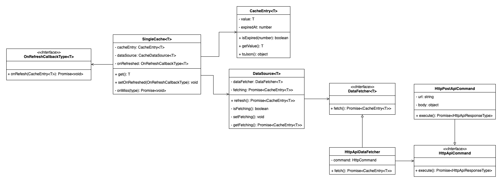

## 프로젝트 설명
크롬 확장 프로그램에서 사용할 `라이센스 검증 API 호출` 기능을 구현한 템플릿 프로젝트이다.

## 문제해결
### 라이센스 검증 API 캐시 요구사항

라이센스 검증 API 는 AWS Lambda Function URL 로 구현됐고, 콜드스타트로 AWS Lambda 가 실행되는 경우, 라이센스 검증 API 의 응답 시간은 평균 2초 정도 걸린다.

사용자 경험 향상을 위해 `stale-while-revalidate` 캐시 전략을 참고하여, `라이센스 검증 여부`는 동기 함수로 조회하고, `라이센스 검증 API`는 비동기 함수로 호출하는 기능을 구현한다. 

### SingleCache
- 라이센스 검증 결과를 SingleCache 의 CacheEntry 에 보관하여 사용한다.
- SingleCache#get 는 동기 함수로 CacheEntry#getValue 값을 즉시 반환한다.

https://github.com/newy2/chrome-extension-template/blob/7c1b0ece8f467eb8078a94fd43e742a4abe70d9f/__tests__/cache/Cache.test.ts#L70-L80

- SingleCache#get 는 CacheEntry 가 만료된 경우, DataSource#refresh 로 CacheEntry 를 최신화 한다.
- SingleCache#setOnRefreshed 는 CacheEntry 값을 Chrome Local Storage 에 저장하기 위해 사용한다. (서비스 워커 비황성화 대비)
 
https://github.com/newy2/chrome-extension-template/blob/7c1b0ece8f467eb8078a94fd43e742a4abe70d9f/src/background.ts#L35-L37

### DataSource
- DataSource#refresh 는 데이터 최신화 작업을 Promise 를 반환하고, Promise 가 소비되기 전까지 DataSource.fetching 에 저장하여 재사용한다.

https://github.com/newy2/chrome-extension-template/blob/7c1b0ece8f467eb8078a94fd43e742a4abe70d9f/__tests__/cache/Cache.test.ts#L120-L128

- DataSource#refresh 가 반환한 Promise 가 소비되면 DataSource.fetching 값을 null 로 초기화한다.

https://github.com/newy2/chrome-extension-template/blob/7c1b0ece8f467eb8078a94fd43e742a4abe70d9f/src/cache/DataSource.ts#L24-L31
